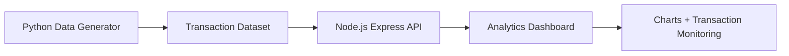

💳 Payment Transaction Analytics Dashboard

A full-stack **financial analytics dashboard** that monitors payment transactions, visualizes key metrics, and detects high-risk activity.
The system simulates real-world **transaction monitoring workflows used in banks like Barclays** for operational insights and risk analysis.

This project demonstrates **data analysis, dashboard design, API development, and business analytics thinking**.

---

# 🚀 Features

### 📊 Analytics Dashboard

* Total Transactions KPI
* Total Transaction Amount
* Successful vs Failed Payments
* Transaction Success Rate

### 📈 Data Visualization

* Pie chart showing **payment channel distribution**
* Visual insights into **UPI, Card, NEFT, and IMPS usage**

### 🔍 Transaction Monitoring

* Dynamic transaction table
* Real-time data loading from backend APIs

### 🎯 Filtering & Investigation

* Filter transactions by **payment type**
* Search transactions by **User ID**

### 🚨 Risk Detection

* Automatically identifies **high-value transactions (> ₹4000)**
* Highlights potential **risk transactions**

### ⚙ Backend API

* REST APIs built using **Node.js and Express**
* Provides transaction data and analytics endpoints

---

# 🏗 System Architecture



**Flow:**

1. Python generates synthetic payment transaction data
2. Data is stored as a JSON dataset
3. Node.js backend serves analytics APIs
4. Frontend dashboard visualizes insights using charts and tables

---

# 🛠 Tech Stack

**Backend**

* Node.js
* Express.js

**Frontend**

* HTML
* CSS
* JavaScript
* Chart.js

**Data Generation**

* Python

**Version Control**

* Git
* GitHub

---

# 📂 Project Structure

```
payment-transaction-dashboard
│
├── analysis
│   └── analyze.py              # Generates synthetic transaction dataset
│
├── backend
│   ├── server.js               # Express API server
│   └── data
│       └── transactions.json   # Transaction dataset
│
├── frontend
│   ├── index.html              # Dashboard UI
│   ├── scripts.js              # Frontend logic
│   └── style.css               # Dashboard styling
│
├── package.json
└── README.md
```

---

# ▶ Running the Project

### 1️⃣ Install dependencies

```bash
npm install
```

### 2️⃣ Generate transaction data

```bash
python analysis/analyze.py
```

### 3️⃣ Start the backend server

```bash
node backend/server.js
```

### 4️⃣ Open dashboard

```
http://localhost:3000
```

---

# 📊 Example Dashboard Insights

The dashboard provides key operational insights such as:

* Payment channel distribution
* Transaction success rates
* High-value transaction monitoring
* User-level payment investigation

These insights help simulate **real business analytics scenarios in financial systems**.

---

# 🎯 Business Analyst Skills Demonstrated

This project highlights key **Business Analyst capabilities**:

* Data analysis & KPI tracking
* Business metric visualization
* Transaction monitoring & risk detection
* Data-driven decision support
* API-based analytics systems

---

# 🔮 Future Improvements

* Fraud detection models
* Time-series payment trend analysis
* Transaction failure monitoring dashboard
* Database integration (PostgreSQL / MongoDB)
* Authentication & role-based access

---

# 👩‍💻 Author

**Pragati Singh**

Aspiring **Business Analyst** with experience in:

* Data analysis
* Financial analytics dashboards
* Stakeholder-driven solution design
* Agile project environments

GitHub:
[https://github.com/pragatis26](https://github.com/pragatis26)

---